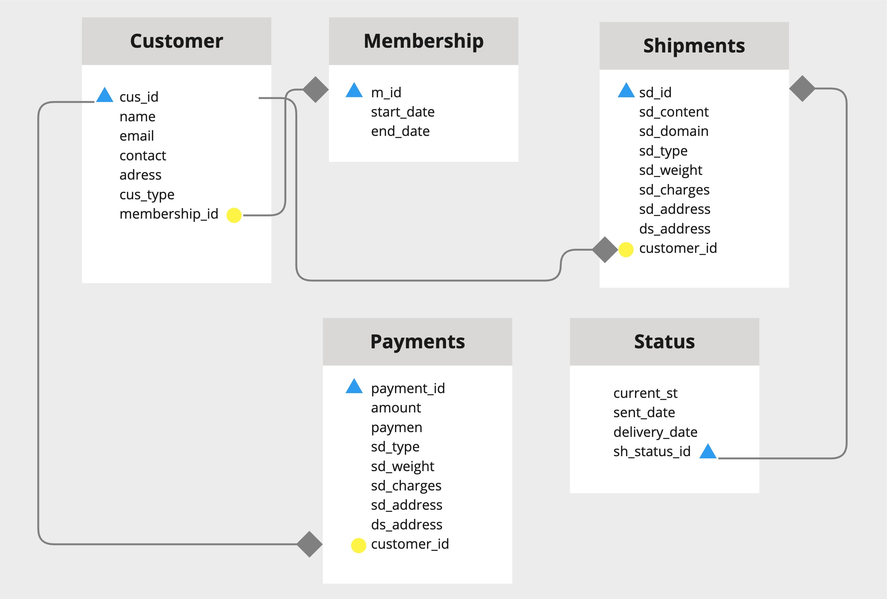
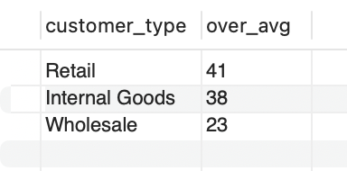
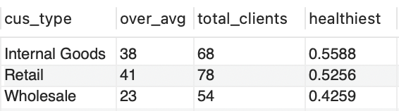
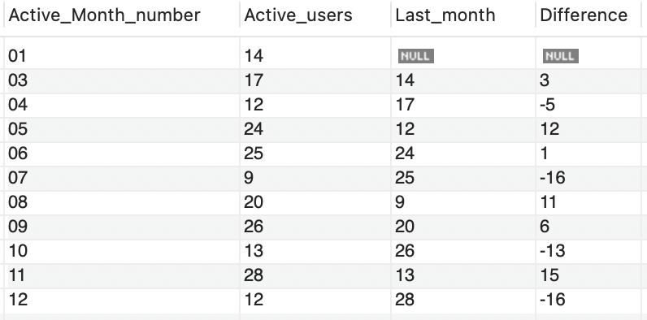
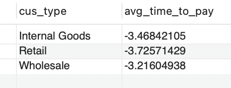
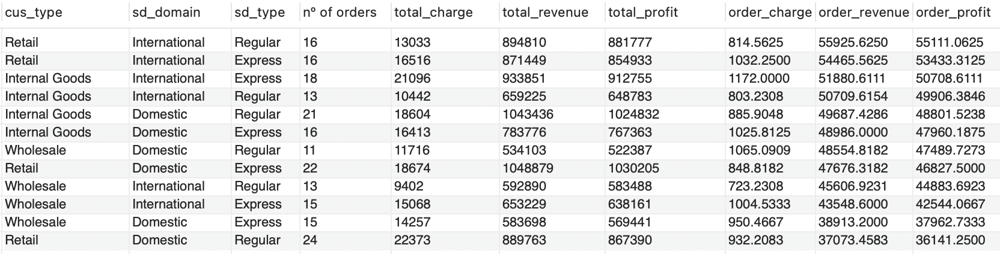
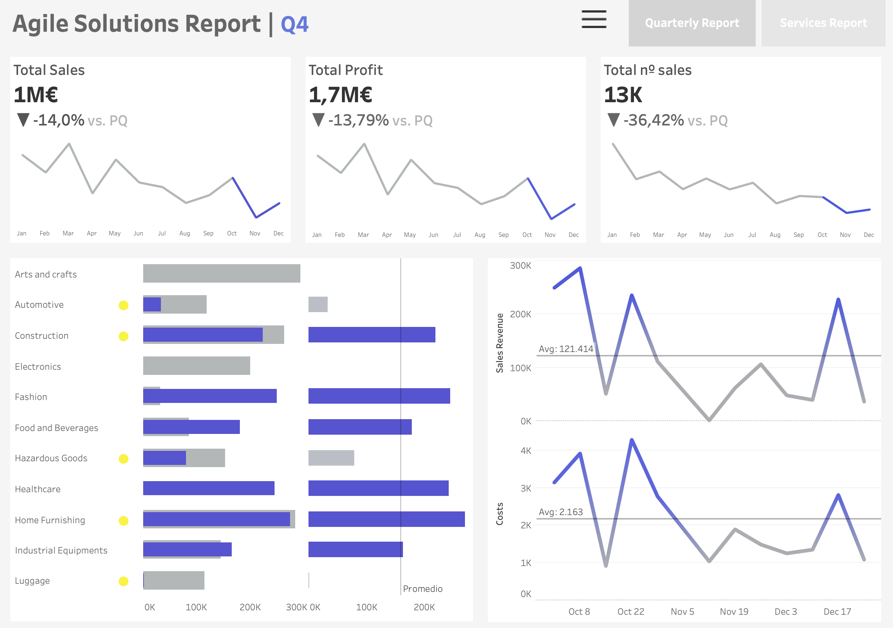

# Agile Solutions Analysis

## Overview

Agile Solutions, a big logistics company based in USA, is facing a problem as we start 2024. Their sales dropped a lot in 2023, and they don't have a clear reason why. So, at the beginning of this year, they need to look at last year and figure out how to fix things.


##

`Characteristics`: Established in the USA with diverse service offerings.

`Vision Challenges`: Struggles with clarity due to its size and maturity.

`Sales Decline`: Drastic drop in sales observed over the past year.

`2024 Objective`: Analyze the situation and understand the root cause.

`Analysis Goal`: Examine 2023 performance and propose solutions.


## Requierements

 **SQL**
 * At least 2 tables are needed for this project. The best number will be at least 3.
 * If you find a dataset that could not be normalized, try creating one Table related to the first of your own. 
 * Use Joins.
 *Use Window Functions.
 * Use aggregations/Group By.
 * Do at least one subquery.
 * At least one Date field must be present, and you have to change its format.

**TABLEAU**
* Create the Joins of tables or Unions as needed
* The presentation must be in Dashboard or Story format, NOT SHEETS
* Use User/Friendly filter
* Parameters are highly recommended. 
* Priorize the structure/presentation: USE CONTAINERS


## Workflow

**Step 1: Data set selection**
- Selected data set from Kaggle
- Format of the data set: csv

**Step 2: Data Base creation**
- Create table structure
- Prepare data content
- Insert data into Data Base

**Step 3: Data Analysis**
- Use MySql workbench for data exploration and analysis

**Step 4: Data visualization**
- Create data visualizations with Tableau
- Show insights discoverd
- Provide conclutive solutiones to the proposed problem


# DATA BASE STRUCTURE



The data base is form by 5 diferent tables that collect data from customers and the orders.
- Customer
- Membership
- Shipments
- Payments
- Status

# Data exploration

## 1. Understand the clients behaviour
Nº of shipments by customer type 
(Wholesale, Internal Goods or Retail)
* Wholesale (mayorista): 54
* Internal Goods (producto interior bruto): 68
* Retail (minorista): 78

The past year Retail had the highest nº of clients pre group

```sql
select c.cus_type, count(s.sd_id)
from shipments_details s
join customer c on s.customer_id = c.cus_id
group by c.cus_type
order by count(s.sd_id) desc;
```


Monthly avg life_time is 6 months
* With the start and end date we obtained the avg life time of the clients
```sql
select avg(life_time)/30 as avg_lifetime from (select *,
DATEDIFF(end_date, start_date) AS life_time
from membership) sub1;
```

I want to know those clients that had a higher lifetime than the avg (6 months)
Customers with life time higher than avg
```sql
select c.cus_id, c.cus_type
from customer c
where c.membership_id in (select m_id from membership where DATEDIFF(end_date, start_date) > (select avg(life_time) as avg_lifetime from (select *,
DATEDIFF(end_date, start_date) AS life_time
from membership) sub1));
```
I now analyse this results counting the type of client that have more clients with lifetime over  with highest retention rate.
* Retail has more clients over average
```sql
select c.cus_type as customer_type, count(c.cus_id) as over_avg
from customer c
where c.membership_id in (select m_id from membership where DATEDIFF(end_date, start_date) > (select avg(life_time) as avg_lifetime from (select *,
DATEDIFF(end_date, start_date) AS life_time
from membership) sub1))
group by c.cus_type
order by count(c.cus_id)desc;
```


Temporary table for client type with retainance higher than average
```sql
create temporary table agile_solutions.higher_retention as (
    select c.cus_type, COUNT(c.cus_id) as over_avg
    from customer c
    where c.membership_id in (
        select m_id 
        from membership 
        where DATEDIFF(end_date, start_date) > (
            select avg(DATEDIFF(end_date, start_date)) 
            from membership
        )
    )
    group by c.cus_type
);
```
In order to get a more accurate insight on which type of client is more healthy we need to calculate this over the total clients in each group. (retail, wholesale and internal goods)

With this query I count the number of memberships by customer type and get the healthy score (The highest number of clients over the average retation rate)

```sql
with total_memberships as (
    select cus_type, COUNT(m_id) as total_clients 
    from membership
    join customer on m_id = membership_id
    group by cus_type
)
select r.cus_type, r.over_avg, tm.total_clients, r.over_avg/tm.total_clients as healthiest
from agile_solutions.higher_retention r
join total_memberships tm on r.cus_type = tm.cus_type
order by r.over_avg/tm.total_clients desc;
```
Internal goods has 55.8 % of their clients over the average life time period



I want to see how the churn has been performing over the year
* July, October and December have had the highest drop

```sql
select 
   m.Active_Month_number,
   m.Active_users, 
   lag(m.Active_users,1) over (order by m.Active_Month_number) as Last_month
from monthly_active_users m;

with cte_view as (select 
   Active_Month_number,
   Active_users, 
   lag(Active_users,1) over (order by Active_Month_number) as Last_month
from monthly_active_users)

select 
   Active_Month_number, 
   Active_users, 
   Last_month, 
   (Active_users - Last_month) as Difference 
from cte_view;
```



## 2. Analyse the spent per client type

Avg ticket per customer group. 
* Internal Goods has the highest avg with 50.298
* Retail 47.498
* Wholesale 43.776
```sql
select c.cus_type, avg(amount) from payment p
join customer c on p.sh_client_id = c.cus_id
group by c.cus_type order by avg(p.amount) desc;
```


Avg time in months to pay per custumer group (3 months)
```sql
select cus_type, avg (sub1.time_to_pay)/30 as avg_time_to_pay 
from customer c
join ( select sh_client_id, DATEDIFF(st.sent_date, p.payment_date) as time_to_pay
from payment p
join status st on p.sh_id = st.sh_status_id)sub1 on c.cus_id = sub1.sh_client_id
group by c.cus_type;
```


## 3. Analyse the serving offering

The company has different product offers based on:
* Range: International / Domestic
* Shipment type: Regular/Express

Based on each type the shipment has different prices and costs. Therefore I want to see which products combination are the most profitable for the company. 
* I want to see the profit per order to get a better overview.
* The most profitable services are Retail > International > Regular

```sql
select cus_type, sd_domain, sd_type, count(sd_type) as 'nº of orders', 
sum(sd_charges) as total_charge,sum(p.amount) as total_revenue, sum(p.amount) - sum(sd_charges) as total_profit, 
sum(sd_charges)/count(sd_type) as order_charge, sum(p.amount)/count(sd_type) as order_revenue, 
(sum(p.amount)/count(sd_type))-(sum(sd_charges)/count(sd_type)) as order_profit 
from shipments_details
join customer on customer_id = cus_id
join payment p on sd_id = p.sh_id
group by cus_type, sd_domain, sd_type
order by order_profit desc;
```



# Data Visualization
For reporting and insights identification I will use Tableau.
This section will complememt the previous analysis focusing in the serial performance of sales. Therefore we will cover a more client based analysis through SQL and a profit analysis with Tableau.

# Conclutions
* Retail is the most profitable segment
* Sales droped drasticaly the last two quarters of the year.
* In Q3 we experienced a high increase in costs
* Hypothesis: 
- External factor: new competitor in the market
- Internar factor: Scale economy decrease (purchase power)
